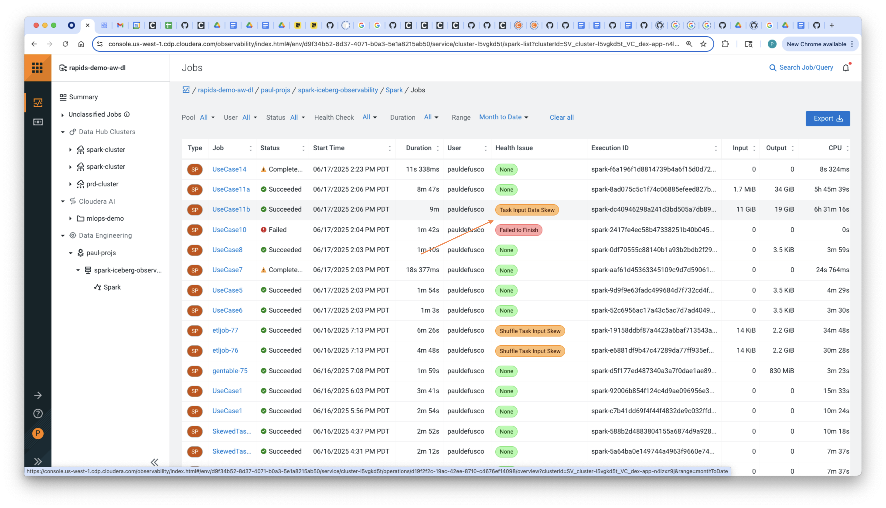
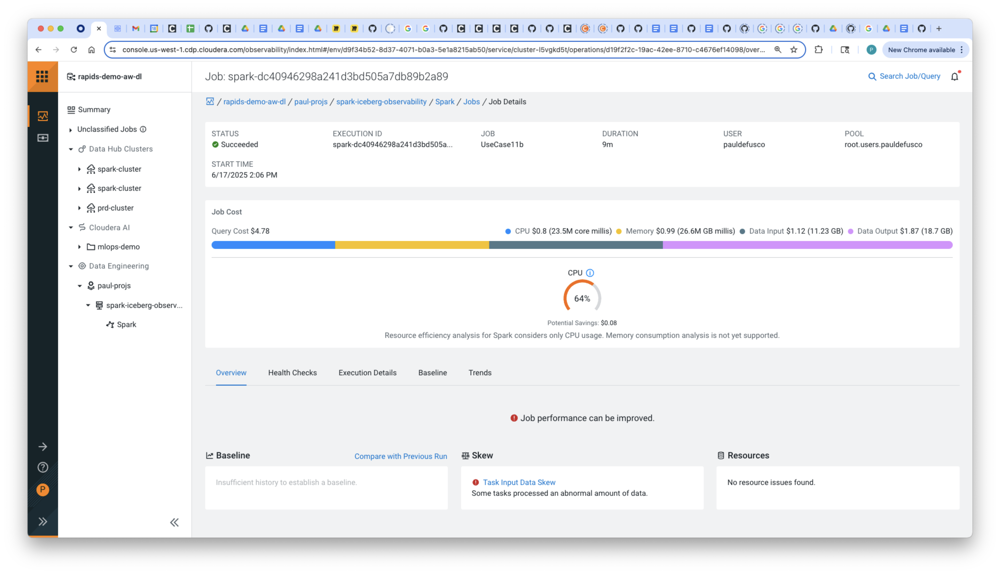
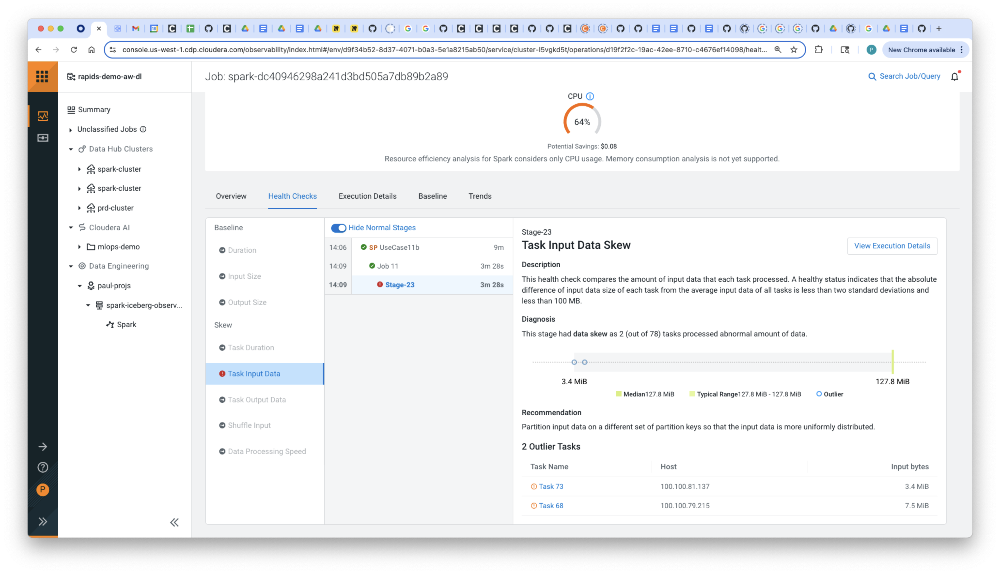

# Spark & Iceberg Observability Use Cases


### Use Case 1: Task Skew

CDE Spark Submit

```
cde spark submit code/use_case_1_task_skew.py \
  --executor-memory "1g" \
  --executor-cores 1
```

CDE Job

```
cde resource create --name spark_observability_hol \
  --type files

cde resource upload --name spark_observability_hol \
  --local-path code/use_case_1_task_skew.py
```

```
cde job create --name use_case_1_task_skew \
  --type spark \
  --application-file use_case_1_task_skew.py \
  --mount-1-resource spark_observability_hol

cde job run --name use_case_1_task_skew \
  --executor-memory "4g" \
  --executor-cores 2 \
  --conf spark.dynamicAllocation.minExecutors=1 \
  --conf spark.dynamicAllocation.maxExecutors=10 \
  --conf spark.sql.shuffle.partitions=10
```

DataHub Livy-Submit

```
curl -X POST https://go01-obsr-de-gateway.go01-dem.ylcu-atmi.cloudera.site:443/go01-obsr-de/cdp-proxy-api/livy_for_spark3/batches \
 -H "Content-Type: application/json" \
 -u pauldefusco:pwd! \
 -d '{
  "file": "/user/pauldefusco/use_case_1_task_skew.py",
  "name": "CDP-Livy-UseCase-1",
  "conf": {
   "spark.dynamicAllocation.enabled": "true",
   "spark.dynamicAllocation.minExecutors": "2",
   "spark.dynamicAllocation.maxExecutors": "10",
   "spark.sql.shuffle.partitions": "200"
  },
  "driverMemory": "4g",
  "executorMemory": "4g",
  "executorCores": 2,
  "numExecutors": 4
 }'
```


### Use Case 2: Overcaching

```
cde spark submit code/use_case_2_overcaching.py \
  --executor-cores 2 \
  --executor-memory "4g"
```

```
cde resource upload --name spark_observability_hol \
  --local-path code/use_case_2_overcaching.py

cde job create --name use_case_2_overcaching \
  --type spark \
  --application-file use_case_2_overcaching.py \
  --mount-1-resource spark_observability_hol

cde job run --name use_case_2_overcaching \
  --executor-memory "4g" \
  --executor-cores 2
```


### Use Case 3: Misconfigured Resources

A spark job without Dynamic Allocation where too many executors, cores, and too much memory are set exceeding the cluster’s capacity.

```
cde spark submit code/use_case_3_overallocating.py \
  --executor-cores 100 \
  --executor-memory "200g"
```

```
cde resource upload --name spark_observability_hol \
  --local-path code/use_case_3_overallocating.py

cde job create --name use_case_3_overallocating \
  --type spark \
  --application-file use_case_3_overallocating.py \
  --mount-1-resource spark_observability_hol

cde job run --name use_case_3_overallocating \
  --executor-cores 100 \
  --executor-memory "200g"
```


### Use Case 4: Misconfigured Resources - Underallocating

A spark job without Dynamic Allocation where too many executors, each having just one or two cores, and minimum memory, are set, leading to OOM error.

```
cde spark submit code/use_case_4_underallocating.py \
  --conf spark.dynamicAllocation.enabled=false \
  --num-executors 1 \
  --executor-cores 1 \
  --executor-memory "1g"
```

```
cde resource upload --name spark_observability_hol \
  --local-path code/use_case_4_underallocating.py

cde job create --name use_case_4_underallocating \
  --type spark \
  --application-file use_case_4_underallocating.py \
  --mount-1-resource spark_observability_hol

cde job run --name use_case_4_underallocating \
  --conf spark.dynamicAllocation.enabled=false \
  --num-executors 1 \
  --executor-cores 1 \
  --executor-memory "1g"
```

### Use Case 5: Misconfigured Resources - Bad Dynamic Allocation

A Spark job with Dynamic Allocation where max and min executors are set wide, each executor having just one or two cores, and minimum memory, are set, leading to too many small tasks.

```
cde spark submit code/use_case_5_bad_da.py \
  --conf spark.sql.shuffle.partitions=10000 \
  --conf spark.dynamicAllocation.minExecutors=1 \
  --conf spark.dynamicAllocation.maxExecutors=50 \
  --executor-cores 1 \
  --executor-memory "1g" \
  --arg s3a://rapids-demo-buk-bb66b705/data/bad_dynamic_allocation
```

```
cde resource upload --name spark_observability_hol \
  --local-path code/use_case_5_bad_da.py

cde job create --name use_case_5_bad_da \
  --type spark \
  --application-file use_case_5_bad_da.py \
  --mount-1-resource spark_observability_hol

cde job run --name use_case_5_bad_da \
  --conf spark.sql.shuffle.partitions=10000 \
  --conf spark.dynamicAllocation.minExecutors=1 \
  --conf spark.dynamicAllocation.maxExecutors=50 \
  --executor-cores 1 \
  --executor-memory "1g" \
  --arg s3a://rapids-demo-buk-bb66b705/data/bad_dynamic_allocation
```

### Use Case 6: Misconfigured Resources - High Shuffle Partitions

A Spark job where shuffle partitions property is set too high or too low.

```
cde spark submit code/use_case_6_high_sp.py \
  --conf spark.sql.shuffle.partitions=10000 \
  --executor-cores 4 \
  --executor-memory "4g" \
  --arg s3a://rapids-demo-buk-bb66b705/data/high_shuffle_partitions
```

```
cde resource upload --name spark_observability_hol \
  --local-path code/use_case_6_high_sp.py

cde job create --name use_case_6_high_sp \
  --type spark \
  --application-file use_case_6_high_sp.py \
  --mount-1-resource spark_observability_hol

cde job run --name use_case_6_high_sp \
  --conf spark.sql.shuffle.partitions=10000 \
  --executor-cores 4 \
  --executor-memory "4g" \
  --arg s3a://rapids-demo-buk-bb66b705/data/high_shuffle_partitions
```

### Use Case 7: Over Bucketing

A Spark Application written in Spark 2 that has been migrated to Spark 3 is creating thousands of small files when writing, after applying the bucketing operation as it was applied in Spark 2.

```
cde spark submit code/use_case_7_over_bucketing.py \
  --executor-cores 4 \
  --executor-memory "4g" \
  --arg default.overbucketing
```

```
cde resource upload --name spark_observability_hol \
  --local-path code/use_case_7_over_bucketing.py

cde job create --name use_case_7_over_bucketing \
  --type spark \
  --application-file use_case_7_over_bucketing.py \
  --mount-1-resource spark_observability_hol

cde job run --name use_case_7_over_bucketing \
  --executor-cores 4 \
  --executor-memory "4g" \
  --arg default.overbucketing
```

### Use Case 8: Unordered Shuffles

A Spark Application written in Spark 2 that has been migrated to Spark 3 is creating thousands of small files when writing, after applying the bucketing operation as it was applied in Spark 2.

```
cde spark submit code/use_case_8_unordered_shuffles.py \
  --conf spark.sql.shuffle.partitions=10000 \
  --executor-cores 4 \
  --executor-memory "4g" \
  --arg s3a://rapids-demo-buk-bb66b705/data/unordered_shuffles
```

```
cde resource upload --name spark_observability_hol \
  --local-path code/use_case_8_unordered_shuffles.py

cde job create --name use_case_8_unordered_shuffles \
  --type spark \
  --application-file use_case_8_unordered_shuffles.py \
  --mount-1-resource spark_observability_hol

cde job run --name use_case_8_unordered_shuffles \
  --conf spark.sql.shuffle.partitions=10000 \
  --executor-cores 4 \
  --executor-memory "4g" \
  --arg s3a://rapids-demo-buk-bb66b705/data/unordered_shuffles
```

### Use Case 9: Overbroadcasting

A Spark Application written in Spark 2 that has been migrated to Spark 3 is creating thousands of small files when writing, after applying the bucketing operation as it was applied in Spark 2.

```
cde spark submit code/use_case_9_overbroadcasting.py \
  --conf spark.sql.autoBroadcastJoinThreshold=-1 \
  --executor-cores 4 \
  --executor-memory "4g" \
  --arg s3a://rapids-demo-buk-bb66b705/data/overbroadcasting
```

```
cde resource upload --name spark_observability_hol \
  --local-path code/use_case_9_overbroadcasting.py

cde job create --name use_case_9_overbroadcasting \
  --type spark \
  --application-file use_case_9_overbroadcasting.py \
  --mount-1-resource spark_observability_hol

cde job run --name use_case_9_overbroadcasting \
  --conf spark.sql.autoBroadcastJoinThreshold=-1 \
  --executor-cores 4 \
  --executor-memory "8g" \
  --arg s3a://rapids-demo-buk-bb66b705/data/overbroadcasting
```

### Use Case 10: Improper Repartitioning

A Spark Application written in Spark 2 that has been migrated to Spark 3 is creating thousands of small files when writing, after applying the bucketing operation as it was applied in Spark 2.

```
cde spark submit code/use_case_10_improper_repartitoning.py \
  --conf spark.sql.shuffle.partitions=200 \
  --executor-cores 4 \
  --executor-memory "4g" \
  --arg s3a://rapids-demo-buk-bb66b705/data/improper_repartitioning
```

```
cde resource upload --name spark_observability_hol \
  --local-path code/use_case_10_improper_repartitioning.py

cde job create --name use_case_10_improper_repartitioning \
  --type spark \
  --application-file use_case_10_improper_repartitioning.py \
  --mount-1-resource spark_observability_hol

cde job run --name use_case_10_improper_repartitioning \
  --conf spark.sql.autoBroadcastJoinThreshold=-1 \
  --executor-cores 4 \
  --executor-memory "4g" \
  --arg s3a://rapids-demo-buk-bb66b705/data/improper_repartitioning
```

### Use Case 11a: Hive Upsert

A Spark Application written in Spark 2 that has been migrated to Spark 3 is creating thousands of small files when writing, after applying the bucketing operation as it was applied in Spark 2.

```
cde spark submit code/use_case_11a_hive_upsert.py \
  --executor-cores 4 \
  --executor-memory "4g" \
  --arg default.hive_upsert_target_table \
  --arg default.hive_upsert_source_table
```

```
cde resource upload --name spark_observability_hol \
  --local-path code/use_case_11a_hive_upsert.py

cde job create --name use_case_11a_hive_upsert \
  --type spark \
  --application-file use_case_11a_hive_upsert.py \
  --mount-1-resource spark_observability_hol

cde job run --name use_case_11a_hive_upsert \
  --executor-cores 4 \
  --executor-memory "4g" \
  --arg default.hive_upsert_target_table \
  --arg default.hive_upsert_source_table \
  --arg default.hive_usert_final_table
```

### Use Case 11b: Iceberg Merge

A Spark Application written in Spark 2 that has been migrated to Spark 3 is creating thousands of small files when writing, after applying the bucketing operation as it was applied in Spark 2.

```
cde spark submit code/use_case_11b_iceberg_merge.py \
  --executor-cores 4 \
  --executor-memory "4g" \
  --arg spark_catalog.default.iceberg_merge_target_table \
  --arg spark_catalog.default.iceberg_merge_source_table
```

```
cde resource upload --name spark_observability_hol \
  --local-path code/use_case_11b_iceberg_merge.py

cde job create --name use_case_11b_iceberg_merge \
  --type spark \
  --application-file use_case_11b_iceberg_merge.py \
  --mount-1-resource spark_observability_hol

cde job run --name use_case_11b_iceberg_merge \
  --executor-cores 4 \
  --executor-memory "4g" \
  --arg spark_catalog.default.iceberg_merge_target_table \
  --arg spark_catalog.default.iceberg_merge_source_table \
  --conf spark.dynamicAllocation.minExecutors=1 \
  --conf spark.dynamicAllocation.maxExecutors=20
```







### Use Case 11c: Iceberg Merge Solution

A Spark Application written in Spark 2 that has been migrated to Spark 3 is creating thousands of small files when writing, after applying the bucketing operation as it was applied in Spark 2.

```
cde spark submit code/use_case_11c_iceberg_merge_sol.py \
  --executor-cores 4 \
  --executor-memory "4g" \
  --arg spark_catalog.default.iceberg_merge_target_table \
  --arg spark_catalog.default.iceberg_merge_source_table
```

```
cde resource upload --name spark_observability_hol \
  --local-path code/use_case_11c_iceberg_merge_sol.py

cde job create --name use_case_11c_iceberg_merge_sol \
  --type spark \
  --application-file use_case_11c_iceberg_merge_sol.py \
  --mount-1-resource spark_observability_hol

cde job run --name use_case_11c_iceberg_merge_sol \
  --executor-cores 4 \
  --executor-memory "4g" \
  --arg spark_catalog.default.iceberg_merge_target_table \
  --arg spark_catalog.default.iceberg_merge_source_table \
  --conf spark.dynamicAllocation.minExecutors=1 \
  --conf spark.dynamicAllocation.maxExecutors=20
```

### Use Case 12a: Hive Incremental

A Spark Application written in Spark 2 that has been migrated to Spark 3 is creating thousands of small files when writing, after applying the bucketing operation as it was applied in Spark 2.

```
cde spark submit code/use_case_12a_hive_incremental.py \
  --executor-cores 4 \
  --executor-memory "4g" \
  --arg default.hive_incremental_target_table \
  --arg default.hive_incremental_source_table \
  --arg s3a://rapids-demo-buk-bb66b705/data/hive_incremental
```

```
cde resource upload --name spark_observability_hol \
  --local-path code/use_case_12a_hive_incremental.py

cde job create --name use_case_12a_hive_incremental \
  --type spark \
  --application-file use_case_12a_hive_incremental.py \
  --mount-1-resource spark_observability_hol

cde job run --name use_case_12a_hive_incremental \
  --executor-cores 4 \
  --executor-memory "4g" \
  --arg default.hive_usert_final_table \
  --arg default.hive_usert_final_table \
  --arg s3a://rapids-demo-buk-bb66b705/data/hive_incremental
```

### Use Case 12b: Iceberg Incremental

A Spark Application written in Spark 2 that has been migrated to Spark 3 is creating thousands of small files when writing, after applying the bucketing operation as it was applied in Spark 2.

```
cde spark submit code/use_case_12b_iceberg_incremental.py \
  --executor-cores 4 \
  --executor-memory "4g" \
  --arg s3a://rapids-demo-buk-bb66b705/data/iceberg_incremental \
  --arg spark_catalog.default.iceberg_incremental_read_table
```

```
cde resource upload --name spark_observability_hol \
  --local-path code/use_case_12b_iceberg_incremental.py

cde job create --name use_case_12b_iceberg_incremental \
  --type spark \
  --application-file use_case_12b_iceberg_incremental.py \
  --mount-1-resource spark_observability_hol

cde job run --name use_case_12b_iceberg_incremental \
  --executor-cores 4 \
  --executor-memory "4g" \
  --arg s3a://rapids-demo-buk-bb66b705/data/iceberg_incremental \
  --arg spark_catalog.default.iceberg_merge_target_table
```

### Use Case 13a: Hive Partition Evolution

A Spark Application written in Spark 2 that has been migrated to Spark 3 is creating thousands of small files when writing, after applying the bucketing operation as it was applied in Spark 2.

```
cde spark submit code/use_case_13a_hive_part_evol.py \
  --executor-cores 4 \
  --executor-memory "4g" \
  --arg default.hive_part_evol_table
```

```
cde resource upload --name spark_observability_hol \
  --local-path code/use_case_13a_hive_part_evol.py

cde job create --name use_case_13a_hive_part_evol \
  --type spark \
  --application-file use_case_13a_hive_part_evol.py \
  --mount-1-resource spark_observability_hol

cde job run --name use_case_13a_hive_part_evol \
  --executor-cores 4 \
  --executor-memory "4g" \
  --arg default.hive_part_evol_table
```

### Use Case 13b: Iceberg Partition Evolution

A Spark Application written in Spark 2 that has been migrated to Spark 3 is creating thousands of small files when writing, after applying the bucketing operation as it was applied in Spark 2.

```
cde spark submit code/use_case_13b_iceberg_part_evol.py \
  --executor-cores 4 \
  --executor-memory "4g" \
  --arg spark_catalog.default.iceberg_part_evol_table
```

```
cde resource upload --name spark_observability_hol \
  --local-path code/use_case_13b_iceberg_part_evol.py

cde job create --name use_case_13b_iceberg_part_evol \
  --type spark \
  --application-file use_case_13b_iceberg_part_evol.py \
  --mount-1-resource spark_observability_hol

cde job run --name use_case_13b_iceberg_part_evol \
  --executor-cores 4 \
  --executor-memory "4g" \
  --arg spark_catalog.default.iceberg_part_evol_table
```

### Use Case 14: Overcaching and Task Skew

Combining Use Cases 1 and 2 into one.

```
cde resource upload --name spark_observability_hol \
  --local-path code/use_case_14_skew_overcaching.py

cde job create --name use_case_14_skew_overcaching \
  --type spark \
  --application-file use_case_14_skew_overcaching.py \
  --mount-1-resource spark_observability_hol

cde job run --name use_case_14_skew_overcaching \
  --executor-cores 4 \
  --executor-memory "8g"
```

DataHub Submit

```
curl -X POST https://go01-obsr-de-gateway.go01-dem.ylcu-atmi.cloudera.site/go01-obsr-de/cdp-proxy-api/livy_for_spark3/batches \
 -H "Content-Type: application/json" \
 -u pauldefusco:Paolino1987! \
 -d '{
  "file": "/user/pauldefusco/use_case_14_skew_overcaching.py",
  "name": "CDP-Livy-UseCase-14",
  "conf": {
   "spark.dynamicAllocation.enabled": "true",
   "spark.dynamicAllocation.minExecutors": "2",
   "spark.dynamicAllocation.maxExecutors": "10",
   "spark.sql.shuffle.partitions": "200"
  },
  "driverMemory": "4g",
  "executorMemory": "4g",
  "executorCores": 2,
  "numExecutors": 4
 }'
```
