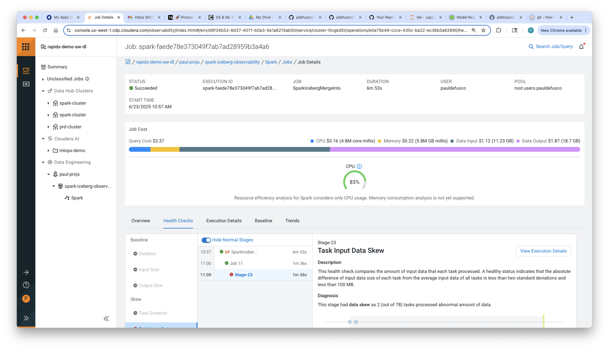
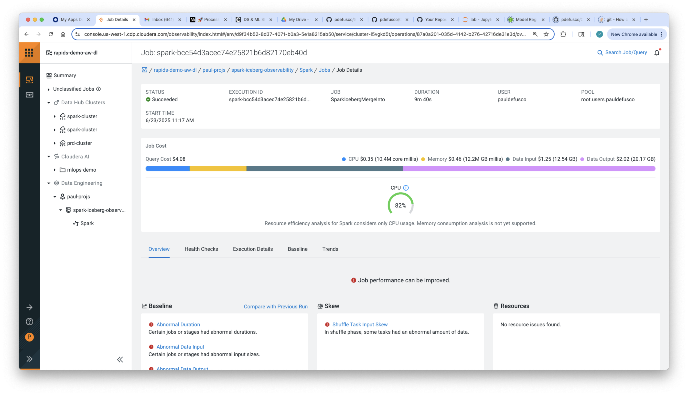
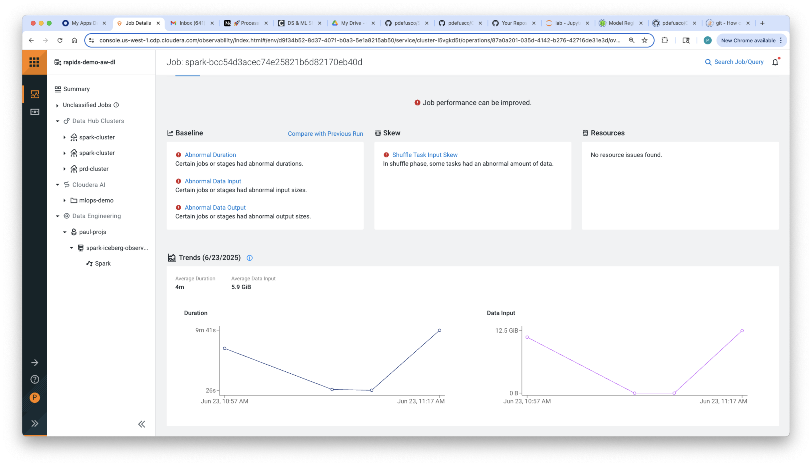
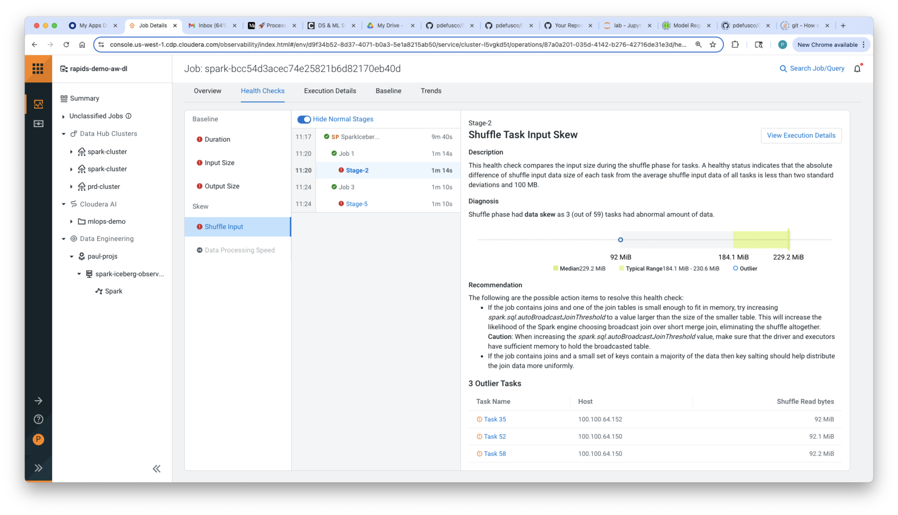
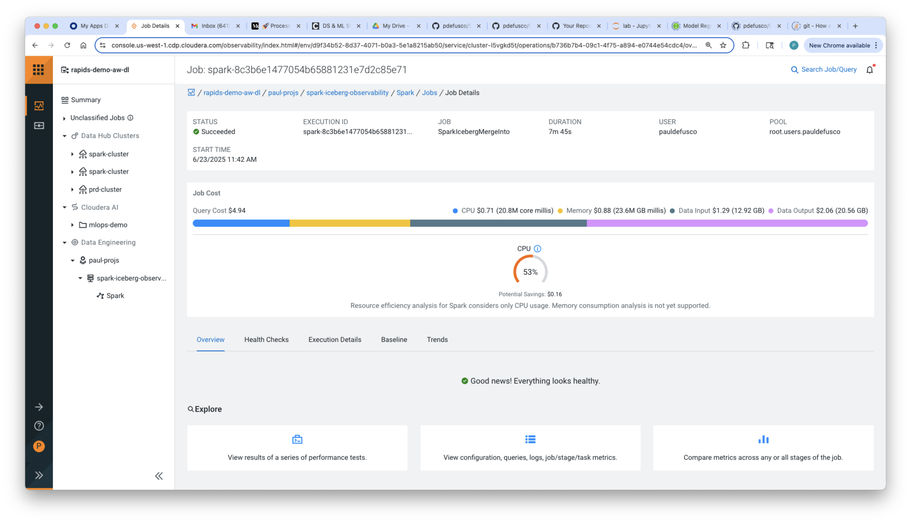
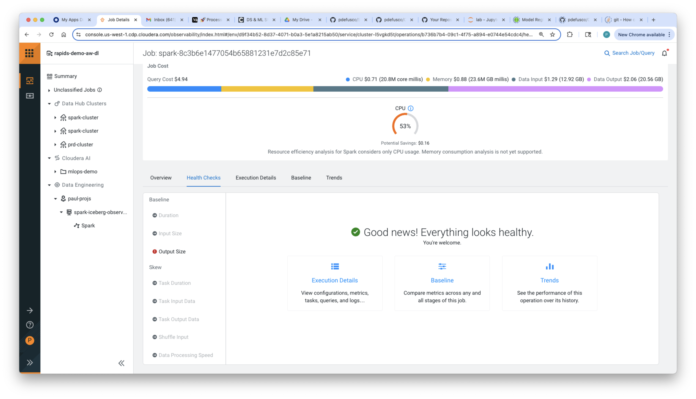

# Spark and Iceberg Observability Hands on Lab

## About this Lab

## About Spark, Iceberg and Cloudera Observability

#### Apache Spark

Apache Spark is an open-source, fast, and powerful big data processing framework. It’s designed for large-scale data analytics and supports tasks like data transformation, machine learning, and real-time stream processing. Spark is known for its speed and ease of use compared to traditional systems like Hadoop.

In Cloudera you can run production Spark use cases at enterprise scale with Cloudera Data Engineering or Cloudera DataHub.

**Cloudera Data Engineering (CDE)** is a service within Cloudera that enables teams to build, schedule, and manage data pipelines at scale using Apache Spark. It provides tools for workflow automation, job monitoring, and resource management in a secure, cloud-native environment.

**Cloudera DataHub** is a flexible data platform that allows users to deploy and manage clusters for data processing, analytics, and machine learning. It supports a wide range of workloads and services like Hive, HBase, and Spark, and can run in hybrid or multi-cloud environments.

#### Apache Iceberg

Apache Iceberg is an open-source table format for large-scale data analytics. It enables reliable, high-performance querying and data management on big data lakes. Iceberg supports features like ACID transactions, schema evolution, and time travel, making it ideal for modern data engineering and analytics workflows.

#### About Cloudera Observability

Cloudera Observability is a monitoring and troubleshooting tool for data pipelines and workloads running on the Cloudera Data Platform (CDP). It provides visibility into system performance, resource usage, and job health, helping data teams optimize performance, detect issues, and ensure efficient operation across hybrid and multi-cloud environments.

#### About Iceberg Merge Into Statement

The Iceberg MERGE INTO statement is used to merge data into an Apache Iceberg table based on specified conditions. It allows for inserts, updates, or deletes in a single SQL operation, making it useful for handling slowly changing dimensions or upserting data efficiently. This feature supports ACID transactions**, ensuring consistency and reliability.

## Lab: Tune Iceberg Merge Into Spark Job

### Lab 1: Starting Spark Application

A Spark Application that upserts data into a target table has been rewritten to leverage the Iceberg Merge Into operation. Modify and run the application in CDE or DataHub Spark using any of the following CLI commands.

##### Option A: Cloudera Data Engineering

```
cde resource create --name spark_observability_hol

cde resource upload --name spark_observability_hol \
  --local-path code/iceberg_merge_baseline.py

cde job create --name iceberg_merge_baseline \
  --type spark \
  --application-file iceberg_merge_baseline.py \
  --mount-1-resource spark_observability_hol

cde job run --name iceberg_merge_baseline \
  --executor-cores 4 \
  --executor-memory "8g" \
  --arg spark_catalog.default.baseline_target_table_1B \
  --arg spark_catalog.default.baseline_source_table_1B \
  --conf spark.dynamicAllocation.minExecutors=1 \
  --conf spark.dynamicAllocation.maxExecutors=20 \
  --conf spark.sql.adaptive.enabled=False \
  --conf spark.sql.shuffle.partitions=200
```

Higher degree of skew:

```
cde resource upload --name spark_observability_hol \
  --local-path code/iceberg_merge_baseline_skew.py

cde job create --name iceberg_merge_baseline_skew \
  --type spark \
  --application-file iceberg_merge_baseline_skew.py \
  --mount-1-resource spark_observability_hol

cde job run --name iceberg_merge_baseline_skew \
  --executor-cores 4 \
  --executor-memory "4g" \
  --arg spark_catalog.default.baseline_target_table_1B \
  --arg spark_catalog.default.baseline_source_table_1B \
  --conf spark.dynamicAllocation.minExecutors=1 \
  --conf spark.dynamicAllocation.maxExecutors=20 \
  --conf spark.sql.adaptive.enabled=False \
  --conf spark.sql.shuffle.partitions=200
```


Before running these modify the job name, source and target table names to reflect your user e.g.

```
cde job create iceberg_merge_baseline_pauld
[...]
```

and

```
cde job run \
[...]
--arg spark_catalog.default.target_table_pauld \
--arg spark_catalog.default.source_table_pauld
```

##### Option B: Cloudera DataHub

Requirement: the pyspark application must have been uploaded in your HDFS path. You can use Hue to upload via the UI.

```
curl -X POST https://spark-cluster-arm-gateway.pdf-jul2.a465-9q4k.cloudera.site/spark-cluster-arm/cdp-proxy-api/livy_for_spark3/batches \
 -H "Content-Type: application/json" \
 -u pauldefusco:pswd! \
 -d '{
  "file": "/user/pauldefusco/iceberg_merge_baseline_skew.py",
  "args": ["baseline_target_table_1B_DH", "baseline_source_table_1B"],
  "name": "MergeIntoSparkApp1B_DH",
  "conf": {
   "spark.dynamicAllocation.enabled": "true",
   "spark.dynamicAllocation.minExecutors": "1",
   "spark.dynamicAllocation.maxExecutors": "20",
   "spark.sql.adaptive.enabled", "False",
   "spark.sql.shuffle.partitions", "200"
  },
  "executorMemory": "8g",
  "executorCores": 4
 }'
```

##### Inspect Run in Observability

Navigate to Cloudera Observability and inspect the job runs. Notice the following feedback:

* Partition input data on a different set of partition keys so that the input data is more uniformly distributed.





### Lab 2: Apply Bucketing

Following the previous recommendation, you can bucket based on ID in order to align the two tables before the join operated by the Merge Into. As before, run the following commands and update the job name and arguments as needed.
g spark_catalog.default.iceberg_merge_source_table

##### Option A: Cloudera Data Engineering

```
cde resource upload --name spark_observability_hol \
  --local-path code/iceberg_merge_tune_1.py

cde job create --name iceberg_merge_tune_1 \
  --type spark \
  --application-file iceberg_merge_tune_1.py \
  --mount-1-resource spark_observability_hol

cde job run --name iceberg_merge_tune_1 \
  --executor-cores 4 \
  --executor-memory "8g" \
  --arg spark_catalog.default.bucket_target_table_tune1 \
  --arg spark_catalog.default.bucket_source_table_tune1 \
  --conf spark.dynamicAllocation.minExecutors=1 \
  --conf spark.dynamicAllocation.maxExecutors=20 \
  --conf spark.sql.adaptive.enabled=False \
  --conf spark.sql.shuffle.partitions=200
```

##### Option B: Cloudera DataHub

Requirement: the pyspark application must have been uploaded in your HDFS path. You can use Hue to upload via the UI.

```
curl -X POST https://spark-cluster-arm-gateway.pdf-jul2.a465-9q4k.cloudera.site/spark-cluster-arm/cdp-proxy-api/livy_for_spark3/batches \
 -H "Content-Type: application/json" \
 -u pauldefusco:pswd! \
 -d '{
  "file": "/user/pauldefusco/iceberg_merge_tune_1.py",
  "args": ["baseline_target_table_1B_DH", "baseline_source_table_1B"],
  "name": "MergeIntoSparkApp1B_DH",
  "conf": {
   "spark.dynamicAllocation.enabled": "true",
   "spark.dynamicAllocation.minExecutors": "1",
   "spark.dynamicAllocation.maxExecutors": "20"
   "spark.sql.adaptive.enabled", "False",
   "spark.sql.shuffle.partitions", "200"
  },
  "driverMemory": "4g",
  "executorMemory": "8g",
  "executorCores": 2
 }'
```

##### Inspect Run in Observability

Navigate to Cloudera Observability and inspect the job runs. Notice the feedback:

* Shuffle phase had data skew as 3 (out of 59) tasks had abnormal amount of data.
* If the job contains joins and one of the join tables is small enough to fit in memory, try increasing spark.sql.autoBroadcastJoinThreshold to a value larger than the size of the smaller table. This will increase the likelihood of the Spark engine choosing broadcast join over short merge join, eliminating the shuffle altogether.
* If the job contains joins and a small set of keys contain a majority of the data then key salting should help distribute the join data more uniformly.








### Lab 3: Apply Salting

Although you bucketed by ID you still ran into significant task skew. Following the previous recommendation, you can use salting to better distribute data across your partitions and resolve this problem.

##### Option A: Cloudera Data Engineering

```
cde resource upload --name spark_observability_hol \
  --local-path code/iceberg_merge_tune_2.py

cde job create --name iceberg_merge_tune_2 \
  --type spark \
  --application-file iceberg_merge_tune_2.py \
  --mount-1-resource spark_observability_hol

cde job run --name iceberg_merge_tune_2 \
  --executor-cores 4 \
  --executor-memory "8g" \
  --arg spark_catalog.default.salt_target_table_tune2 \
  --arg spark_catalog.default.salt_source_table_tune2 \
  --conf spark.dynamicAllocation.minExecutors=1 \
  --conf spark.dynamicAllocation.maxExecutors=20 \
  --conf spark.sql.shuffle.partitions=200
```

##### Option B: Cloudera DataHub

Requirement: the pyspark application must have been uploaded in your HDFS path. You can use Hue to upload via the UI.

```
curl -X POST https://spark-cluster-arm-gateway.pdf-jul2.a465-9q4k.cloudera.site/spark-cluster-arm/cdp-proxy-api/livy_for_spark3/batches \
 -H "Content-Type: application/json" \
 -u pauldefusco:pswd! \
 -d '{
  "file": "/user/pauldefusco/iceberg_merge_tune_2.py",
  "args": ["baseline_target_table_1B_DH", "baseline_source_table_1B"],
  "name": "MergeIntoSparkApp1B_DH",
  "conf": {
   "spark.dynamicAllocation.enabled": "true",
   "spark.dynamicAllocation.minExecutors": "1",
   "spark.dynamicAllocation.maxExecutors": "20",
   "spark.sql.adaptive.enabled", "False",
   "spark.sql.shuffle.partitions", "200"
  },
  "driverMemory": "4g",
  "executorMemory": "8g",
  "executorCores": 4
}'
```

##### Inspect Run in Observability

Navigate to Cloudera Observability and inspect the job runs.





Notice the following:

* All warnings have gone away.


### Optional Lab 4: Detect Overcaching

An colleague suggested caching the data to speed up the join.

##### Option A: Cloudera Data Engineering

```
cde resource upload --name spark_observability_hol \
  --local-path code/iceberg_merge_caching.py

cde job create --name iceberg_merge_caching \
  --type spark \
  --application-file iceberg_merge_caching.py \
  --mount-1-resource spark_observability_hol

cde job run --name iceberg_merge_caching \
  --executor-cores 4 \
  --executor-memory "4g" \
  --arg spark_catalog.default.iceberg_merge_target_table \
  --arg spark_catalog.default.iceberg_merge_source_table \
  --conf spark.dynamicAllocation.minExecutors=1 \
  --conf spark.dynamicAllocation.maxExecutors=20 \
  --conf spark.sql.adaptive.enabled=False \
  --conf spark.sql.shuffle.partitions=200
```
